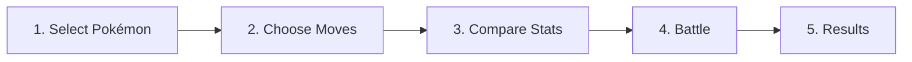
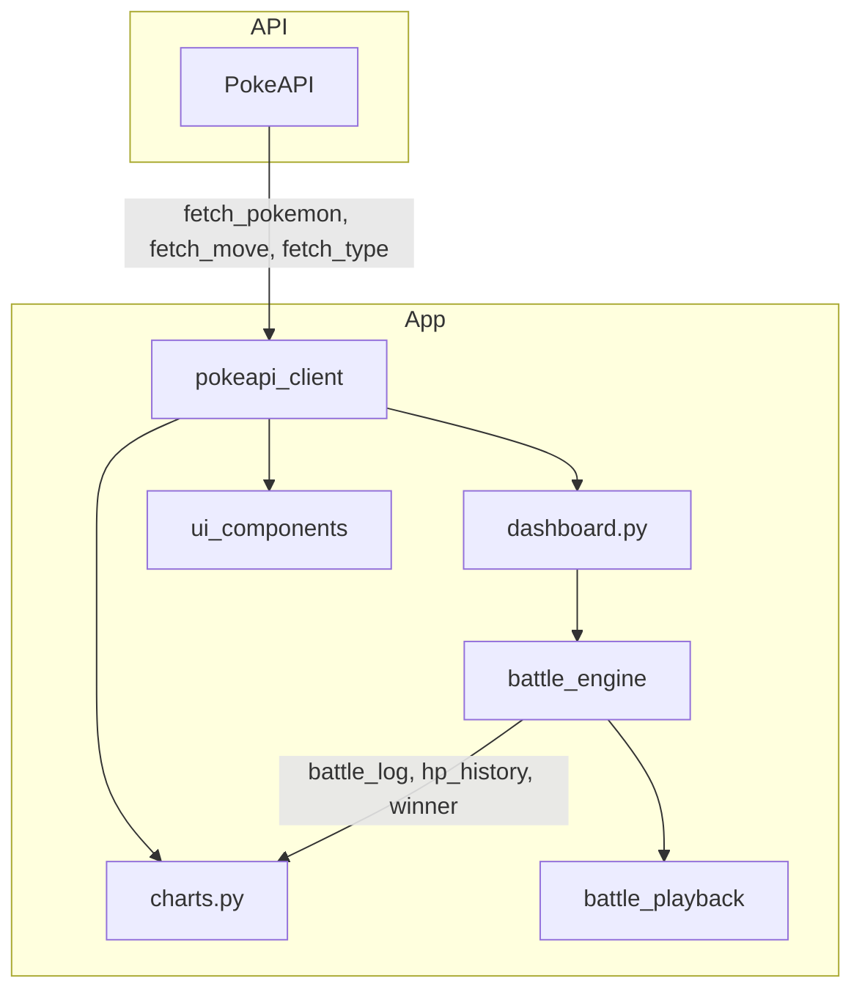

<div align="center">

# ⚡ Pokémon Combat Simulator

### *Master MDBA - IE University — Group 8 | Interactive Battle Dashboard*

*Built with fun and streamlit ⚡ for you Dani hope you will have fun with it ! 😉*

[](https://streamlit.io)
[](https://python.org)
[](https://pokeapi.co)

*A turn-based Pokémon battle simulator with type effectiveness, stat comparison charts, and a retro Game Boy–style interface.*

**Live Demo:** [https://pokemon-battle-group8.streamlit.app]

---

</div>

## 📋 Table of Contents

- [Overview](#-overview)
- [Features](#-features)
- [Project Structure](#-project-structure)
- [Environment Setup with UV](#-environment-setup-with-uv)
- [Running the Application](#-running-the-application)
- [Components & Architecture](#-components--architecture)
- [Scope & Usability](#-scope--usability)
- [Contributors](#-contributors)

---

## 🎮 Overview

**Pokémon Combat Simulator** is an interactive Streamlit dashboard built for the Master Data course. It fetches live data from the [PokeAPI](https://pokeapi.co/api/v2/), lets users select two Pokémon and their moves, and runs a turn-based battle simulation with full type effectiveness, stat comparison, and visual feedback.

The app combines **APIs**, **pandas**, **OOP**, and **Streamlit** into a cohesive, playable experience with a nostalgic Game Boy Color aesthetic.

---

## ✨ Features

| Feature | Description |
|---------|-------------|
| **5-Step Flow** | Select Pokémon → Choose Moves → Compare Stats → Battle → Results |
| **Live API Data** | Fetches Pokémon, moves, and type data from PokeAPI |
| **Type Effectiveness** | Full dual-type defender support (multipliers per type) |
| **Stat Comparison** | Grouped bar chart comparing HP, ATK, DEF, SP.ATK, SP.DEF, SPE |
| **Battle Simulation** | Turn-based combat with speed order, accuracy checks, damage formula |
| **HP Over Time Chart** | Line chart showing HP depletion per round |
| **Battle Playback** | Optional animated battle with sprites, HP bars, and sound effects |
| **Intro Screen** | Optional full-screen video overlay with “Press Start” |
| **Retro UI** | Game Boy Color–inspired design with pixel fonts and type badges |

---

## 📁 Project Structure

```
group_assignment/
├── dashboard.py              # Main app entry point — orchestrates 5-step flow
├── ui.css                    # Design system (tokens, components, layout)
├── requirements.txt          # Python dependencies
├── README.md                 # This file
│
├── src/
│   ├── __init__.py           # Package exports
│   ├── pokeapi_client.py     # PokeAPI client (pokemon, move, type endpoints)
│   ├── battle_engine.py      # Turn-based battle simulation (OOP)
│   ├── ui_components.py      # Trainer cards, move selection, arena, banners
│   ├── charts.py             # Plotly stat comparison & HP history charts
│   ├── battle_playback.py    # Animated battle with sprites & sound
│   ├── intro_component.py    # Intro video overlay
│   └── sound_engine.py       # 8-bit sound effects
│
├── assets/
│   └── Pokemon_loading_screen_group_8_delpmaspu_-2.mp4   # Intro video (optional)
│
├── deploy/
│   ├── requirements.txt      # Deployment dependencies
│   └── .streamlit/config.toml
│
├── .streamlit/
│   └── config.toml           # Streamlit theme (colors, fonts)
│
└── docs/
    ├── SPEC.md               # Grading rubric & requirements
    ├── HANDOFF.md            # Agent handoff notes
    └── SCOPE_PLUS.md         # Optional features
```

---

## 🚀 Environment Setup with UV

[**UV**](https://docs.astral.sh/uv/) is a fast Python package installer and resolver. Follow these steps to set up the project on **any machine** (macOS, Linux, or Windows).

### Step 1: Install UV

| Platform | Command |
|----------|---------|
| **macOS / Linux** | `curl -LsSf https://astral.sh/uv/install.sh \| sh` |
| **Windows (PowerShell)** | `powershell -c "irm https://astral.sh/uv/install.ps1 \| iex"` |
| **pip (any OS)** | `pip install uv` |

### Step 2: Clone the Repository

```bash
git clone <your-repo-url>
cd group_assignment
```

### Step 3: Create Virtual Environment

```bash
uv venv
```

This creates a `.venv` directory in the project root.

### Step 4: Install Dependencies

```bash
uv pip install -r requirements.txt
```

### Step 5: Run the Application

```bash
uv run streamlit run dashboard.py
```

`uv run` automatically uses the project’s `.venv` and runs Streamlit. No manual activation needed.

---

### Alternative: Manual Activation

If you prefer to activate the virtual environment yourself:

| Platform | Activate | Run |
|----------|----------|-----|
| **macOS / Linux** | `source .venv/bin/activate` | `streamlit run dashboard.py` |
| **Windows (CMD)** | `.venv\Scripts\activate.bat` | `streamlit run dashboard.py` |
| **Windows (PowerShell)** | `.venv\Scripts\Activate.ps1` | `streamlit run dashboard.py` |

---

### Quick Reference (UV)

| Task | Command |
|------|---------|
| Create venv | `uv venv` |
| Install deps | `uv pip install -r requirements.txt` |
| Run app | `uv run streamlit run dashboard.py` |
| Sync to exact deps | `uv pip sync -r requirements.txt` |

---

## ▶️ Running the Application

1. **Start the app** (after setup):
   ```bash
   uv run streamlit run dashboard.py
   ```

2. **Open in browser** — Streamlit usually opens `http://localhost:8501` automatically.

3. **Optional intro video** — If `assets/Pokemon_loading_screen_group_8_delpmaspu_-2.mp4` exists, the intro screen is shown. If missing, the app skips it and goes straight to the main flow.

---

## 🧩 Components & Architecture

### Module Overview

| Module | File | Responsibility |
|--------|------|----------------|
| **Main App** | `dashboard.py` | Step flow, session state, navigation, step handlers |
| **PokeAPI Client** | `src/pokeapi_client.py` | `fetch_pokemon`, `fetch_move`, `fetch_type`; `@st.cache_data`; helpers for stats, types, sprites, effectiveness |
| **Battle Engine** | `src/battle_engine.py` | `BattleEngine` class; turn-based simulation; damage formula; speed order; outputs `battle_log`, `hp_history`, `winner` |
| **UI Components** | `src/ui_components.py` | Trainer cards, move selection, arena preview, type matchup, winner banner, step indicator |
| **Charts** | `src/charts.py` | `render_stat_comparison` (grouped bar via `.melt()`), `render_hp_history` (line chart) |
| **Battle Playback** | `src/battle_playback.py` | Animated battle with HP bars, sprites, arena themes, sound |
| **Intro Component** | `src/intro_component.py` | Full-screen video overlay; “Press Start” button |
| **Sound Engine** | `src/sound_engine.py` | 8-bit WAV sounds (select, attack, hit, miss, victory) |

### User Flow



### Data Flow



### Session State

| Key | Purpose |
|-----|---------|
| `current_step` | 1–5 (Select → Moves → Compare → Battle → Results) |
| `p1_pokemon`, `p2_pokemon` | Selected Pokémon data |
| `p1_move`, `p2_move` | Selected move data |
| `battle_results` | Output from `BattleEngine` |
| `battle_played` | Whether battle has been run |
| `show_playback` | Toggle for animated playback |
| `sound_enabled` | Toggle for sound effects |
| `intro_done` | Whether intro screen was completed |

---

## 📐 Scope & Usability

### Scope

- **In scope:** Pokémon selection, move selection (damaging only), stat comparison, turn-based battle, type effectiveness (dual-type), battle log, HP chart, optional playback and intro.
- **Out of scope:** PP tracking, rematch flow, animated sprites, persistent user accounts.

### Usability

- **Target users:** Students, Pokémon fans, anyone exploring the PokeAPI.
- **Flow:** Linear 5-step wizard with clear navigation.
- **Error handling:** Invalid Pokémon names and API failures are handled gracefully.
- **Accessibility:** High-contrast colors, readable fonts (Press Start 2P, VT323).
- **Responsiveness:** Layout uses Streamlit columns for side-by-side panels.

### Dependencies

| Package | Version | Purpose |
|---------|---------|---------|
| `streamlit` | ≥1.30.0 | Web app framework |
| `pandas` | ≥2.0.0 | DataFrames, `.melt()`, battle log |
| `requests` | ≥2.31.0 | PokeAPI HTTP calls |
| `plotly` | ≥5.18.0 | Stat comparison & HP charts |

---

## 👥 Contributors

**Group 8 — Master Data**

| Member |
|--------|
| Rayane Boumediene Mazari |
| Sacha Huberty |
| Shreya Jha |
| Smaragda Apostolou |
| Marco De Palma |
| Pipe |

---

<div align="center">

*Built with fun and streamlit ⚡ for you Dani hope you will have fun with it ! 😉*

</div>
